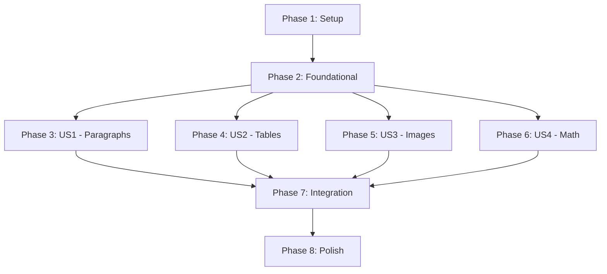

# Tasks: DOCX Extraction Pipeline

**Feature**: 006-docx-extraction  
**Input**: Design documents from `/specs/006-docx-extraction/`  
**Prerequisites**: plan.md, spec.md, research.md, data-model.md, contracts/dij-schema-v1.0.json

**Constitution Requirement**: All tasks follow TDD approach with tests written FIRST (Principle IX: Unit Testing Mandatory)

## Task Format: `- [ ] [ID] [P?] [Story] Description`

- **[P]**: Task can run in parallel (different files, no blocking dependencies)
- **[Story]**: User story label (US1, US2, US3, US4) - REQUIRED for story tasks
- **File paths**: All tasks include exact file locations

---

## Phase 1: Setup (Shared Infrastructure)

**Purpose**: Project initialization and dependencies

- [X] T001 Add python-docx>=1.1.0 and lxml>=5.0.0 to backend/pyproject.toml dependencies
- [X] T002 Install new dependencies in virtual environment: pip install python-docx lxml
- [X] T003 [P] Create test fixtures directory: backend/tests/fixtures/sample_exams/
- [X] T004 [P] Create simple_text.docx fixture with 5 paragraphs (plain and formatted text)
- [X] T005 [P] Create with_tables.docx fixture with 2 tables (simple and merged cells)
- [X] T006 [P] Create with_images.docx fixture with 3 embedded images (PNG, JPEG)
- [X] T007 [P] Create with_math.docx fixture with 4 OMML equations

**Checkpoint**: Dependencies installed, test fixtures ready

---

## Phase 2: Foundational (Blocking Prerequisites)

**Purpose**: Core infrastructure that MUST complete before ANY user story implementation

**⚠️ CRITICAL**: No user story work can begin until this phase is complete

### DIJ Schema Models (Required by All Stories)

- [ ] T008 Create backend/app/schemas/dij.py with DIJv1 base model (version, document_id, blocks, metadata)
- [ ] T009 Add BlockType enum (PARAGRAPH, TABLE, IMAGE, MATH) to backend/app/schemas/dij.py
- [ ] T010 [P] Add Provenance model to backend/app/schemas/dij.py
- [ ] T011 [P] Add ExtractionMetadata model to backend/app/schemas/dij.py
- [ ] T012 [P] Add Block base model to backend/app/schemas/dij.py

### Error Handling Infrastructure

- [ ] T013 Create backend/app/core/exceptions.py with ExtractionError class (error_code, user_message, technical_details, original_exception)
- [ ] T014 Add error code constants to backend/app/core/exceptions.py (DOCX_INVALID_FORMAT, DOCX_CORRUPTED, DOCX_TOO_LARGE, EXTRACTION_TIMEOUT, etc.)

### Base Parser Infrastructure

- [ ] T015 Create backend/app/core/docx_parser.py with DocxParser class skeleton
- [ ] T016 Add DOCX file validation method to DocxParser (check file exists, size limit 50MB, valid DOCX format)
- [ ] T017 [P] Add extraction timeout decorator (5 minute max) in backend/app/core/docx_parser.py

**Checkpoint**: Foundation ready - user story implementation can now begin in parallel

---

## Phase 3: User Story 1 - Extract Text Paragraphs (Priority: P1) 🎯 MVP

**Goal**: Extract text paragraphs with comprehensive formatting metadata and produce basic DIJ output

**Independent Test**: Upload DOCX with only text paragraphs → verify DIJ contains all paragraph blocks with accurate text and formatting

### Tests for User Story 1 (MANDATORY - Write FIRST) ✅

> **CONSTITUTION REQUIREMENT**: Write these tests FIRST, ensure they FAIL before implementation

- [ ] T018 [P] [US1] Unit test: Extract single plain paragraph from simple_text.docx in backend/tests/unit/test_docx_parser.py
- [ ] T019 [P] [US1] Unit test: Extract paragraph with bold/italic/underline formatting in backend/tests/unit/test_docx_parser.py
- [ ] T020 [P] [US1] Unit test: Extract paragraph with font metadata (name, size, color) in backend/tests/unit/test_docx_parser.py
- [ ] T021 [P] [US1] Unit test: Filter empty paragraphs (verify not in output) in backend/tests/unit/test_docx_parser.py
- [ ] T022 [P] [US1] Unit test: Verify paragraph sequence numbering (1-indexed) in backend/tests/unit/test_docx_parser.py
- [ ] T023 [P] [US1] Unit test: Verify provenance metadata for each paragraph block in backend/tests/unit/test_docx_parser.py

### Schema Models for User Story 1

- [ ] T024 [P] [US1] Add ParagraphContent model to backend/app/schemas/dij.py (runs, alignment, indents, spacing, style)
- [ ] T025 [P] [US1] Add TextRun model to backend/app/schemas/dij.py (text, bold, italic, underline, font_name, font_size, color)

### Implementation for User Story 1

- [ ] T026 [US1] Implement extract_blocks() method in backend/app/core/docx_parser.py (iterate paragraphs, skip empty)
- [ ] T027 [US1] Implement _extract_paragraph() method in backend/app/core/docx_parser.py (extract text runs with formatting)
- [ ] T028 [US1] Implement _extract_text_run() helper in backend/app/core/docx_parser.py (bold, italic, underline, font properties, color conversion to hex)
- [ ] T029 [US1] Implement _extract_paragraph_format() helper in backend/app/core/docx_parser.py (alignment, indents, spacing, line spacing, style)
- [ ] T030 [US1] Add provenance metadata generation in backend/app/core/docx_parser.py (_create_provenance method)
- [ ] T031 [US1] Add block sequence numbering logic in backend/app/core/docx_parser.py
- [ ] T032 [US1] Create backend/app/services/extraction_service.py with ExtractionService class
- [ ] T033 [US1] Implement extract_dij() method skeleton in backend/app/services/extraction_service.py (coordinates parser, builds DIJ, handles timing)
- [ ] T034 [US1] Build DIJ metadata in extraction_service.py (extraction_timestamp, source_filename, total_blocks, block_type_counts, duration_ms, warnings)
- [ ] T035 [US1] Validate DIJ against Pydantic schema before returning in extraction_service.py

### Integration Tests for User Story 1

- [ ] T036 [US1] Integration test: Extract simple_text.docx fixture → verify complete DIJ structure in backend/tests/integration/test_extract_docx_stage.py
- [ ] T037 [US1] Integration test: Verify 100% text accuracy (character-for-character match) in backend/tests/integration/test_extract_docx_stage.py
- [ ] T038 [US1] Integration test: Verify formatting metadata completeness in backend/tests/integration/test_extract_docx_stage.py

**Checkpoint**: Text paragraph extraction fully functional - MVP deliverable

---

## Phase 4: User Story 2 - Extract Tables (Priority: P2)

**Goal**: Extract table structures with rows, columns, cells, spans, and nested content

**Independent Test**: Upload DOCX with only tables → verify DIJ accurately represents table structure and cell content

### Tests for User Story 2 (MANDATORY - Write FIRST) ✅

> **CONSTITUTION REQUIREMENT**: Write these tests FIRST, ensure they FAIL before implementation

- [ ] T039 [P] [US2] Unit test: Extract simple table (3x3, no spans) from with_tables.docx in backend/tests/unit/test_docx_parser.py
- [ ] T040 [P] [US2] Unit test: Extract table with merged cells (rowspan, colspan) in backend/tests/unit/test_docx_parser.py
- [ ] T041 [P] [US2] Unit test: Extract table with header row flag in backend/tests/unit/test_docx_parser.py
- [ ] T042 [P] [US2] Unit test: Extract table with cell borders and background colors in backend/tests/unit/test_docx_parser.py
- [ ] T043 [P] [US2] Unit test: Extract table with formatted text in cells in backend/tests/unit/test_docx_parser.py

### Schema Models for User Story 2

- [ ] T044 [P] [US2] Add TableContent model to backend/app/schemas/dij.py (rows, style)
- [ ] T045 [P] [US2] Add TableRow model to backend/app/schemas/dij.py (cells, is_header)
- [ ] T046 [P] [US2] Add TableCell model to backend/app/schemas/dij.py (content, rowspan, colspan, background_color, borders)
- [ ] T047 [P] [US2] Add CellContent model to backend/app/schemas/dij.py (type: text/image/math, data)
- [ ] T048 [P] [US2] Add CellBorders and BorderStyle models to backend/app/schemas/dij.py

### Implementation for User Story 2

- [ ] T049 [US2] Implement _extract_table() method in backend/app/core/docx_parser.py (detect tables in document)
- [ ] T050 [US2] Implement _extract_table_rows() helper in backend/app/core/docx_parser.py (iterate rows, detect header rows)
- [ ] T051 [US2] Implement _extract_table_cell() helper in backend/app/core/docx_parser.py (cell content, spans, background, borders)
- [ ] T052 [US2] Handle nested paragraphs in table cells in backend/app/core/docx_parser.py (_extract_cell_paragraphs)
- [ ] T053 [US2] Update extract_blocks() in backend/app/core/docx_parser.py to handle mixed paragraphs and tables
- [ ] T054 [US2] Update extraction_service.py to handle table blocks in block_type_counts

### Integration Tests for User Story 2

- [ ] T055 [US2] Integration test: Extract with_tables.docx fixture → verify table structure accuracy (95% per SC-004) in backend/tests/integration/test_extract_docx_stage.py
- [ ] T056 [US2] Integration test: Verify cell span metadata correctness in backend/tests/integration/test_extract_docx_stage.py

**Checkpoint**: Table extraction functional - US1 and US2 both work independently

---

## Phase 5: User Story 3 - Extract Images (Priority: P3)

**Goal**: Extract images, store as external artifacts, create DIJ image block references

**Independent Test**: Upload DOCX with embedded images → verify images stored as artifacts and DIJ contains correct references

### Tests for User Story 3 (MANDATORY - Write FIRST) ✅

> **CONSTITUTION REQUIREMENT**: Write these tests FIRST, ensure they FAIL before implementation

- [ ] T057 [P] [US3] Unit test: Extract single PNG image from with_images.docx in backend/tests/unit/test_image_extractor.py
- [ ] T058 [P] [US3] Unit test: Extract JPEG image and verify format preservation in backend/tests/unit/test_image_extractor.py
- [ ] T059 [P] [US3] Unit test: Generate unique artifact filename (task_id_sequence_image_id.ext) in backend/tests/unit/test_image_extractor.py
- [ ] T060 [P] [US3] Unit test: Upload image to S3/MinIO via artifact_service in backend/tests/unit/test_image_extractor.py (mock S3)
- [ ] T061 [P] [US3] Unit test: Create artifact record with correct metadata in backend/tests/unit/test_image_extractor.py
- [ ] T062 [P] [US3] Unit test: Detect duplicate images by content hash in backend/tests/unit/test_image_extractor.py

### Schema Models for User Story 3

- [ ] T063 [P] [US3] Add ImageContent model to backend/app/schemas/dij.py (artifact_id, width, height, alt_text, title, content_type)

### Implementation for User Story 3

- [ ] T064 [US3] Create backend/app/core/image_extractor.py with ImageExtractor class
- [ ] T065 [US3] Implement extract_images() method in ImageExtractor (find all InlineShapes and drawing objects)
- [ ] T066 [US3] Implement _extract_image_binary() helper in ImageExtractor (get image.blob from relationships)
- [ ] T067 [US3] Implement _generate_artifact_filename() in ImageExtractor (format: task_id_seq_id.ext)
- [ ] T068 [US3] Implement _compute_content_hash() in ImageExtractor (SHA256 for deduplication)
- [ ] T069 [US3] Implement extract_and_upload() method in ImageExtractor (upload to S3, create artifact record, return artifact_id)
- [ ] T070 [US3] Update _extract_paragraph() in docx_parser.py to detect inline images
- [ ] T071 [US3] Add _extract_image() method to docx_parser.py (create image block placeholder with position)
- [ ] T072 [US3] Update extraction_service.py to process image blocks (call ImageExtractor, populate artifact_id)
- [ ] T073 [US3] Update extraction_service.py to handle image upload errors gracefully

### Integration Tests for User Story 3

- [ ] T074 [US3] Integration test: Extract with_images.docx → verify all images stored as artifacts (SC-005) in backend/tests/integration/test_extract_docx_stage.py
- [ ] T075 [US3] Integration test: Verify DIJ image blocks contain valid artifact_id references in backend/tests/integration/test_extract_docx_stage.py
- [ ] T076 [US3] Integration test: Verify image content integrity (no data loss) in backend/tests/integration/test_extract_docx_stage.py

**Checkpoint**: Image extraction functional - US1, US2, US3 all work independently

---

## Phase 6: User Story 4 - Math Conversion (Priority: P4)

**Goal**: Convert OMML equations to LaTeX with OMML fallback preservation

**Independent Test**: Upload DOCX with math equations → verify DIJ contains LaTeX for 90% of equations

### Tests for User Story 4 (MANDATORY - Write FIRST) ✅

> **CONSTITUTION REQUIREMENT**: Write these tests FIRST, ensure they FAIL before implementation

- [ ] T077 [P] [US4] Unit test: Extract OMML XML from with_math.docx in backend/tests/unit/test_math_converter.py
- [ ] T078 [P] [US4] Unit test: Convert simple OMML equation to LaTeX in backend/tests/unit/test_math_converter.py
- [ ] T079 [P] [US4] Unit test: Convert complex nested OMML to LaTeX in backend/tests/unit/test_math_converter.py
- [ ] T080 [P] [US4] Unit test: Handle OMML conversion failure (preserve OMML, set conversion_failed=true) in backend/tests/unit/test_math_converter.py
- [ ] T081 [P] [US4] Unit test: Detect inline vs display-mode equations in backend/tests/unit/test_math_converter.py

### Schema Models for User Story 4

- [ ] T082 [P] [US4] Add MathContent model to backend/app/schemas/dij.py (latex, omml, conversion_failed, conversion_error)

### Implementation for User Story 4

- [ ] T083 [US4] Create backend/app/core/math_converter.py with MathConverter class
- [ ] T084 [US4] Implement extract_omml() method in MathConverter (find oMath elements in document XML)
- [ ] T085 [US4] Implement convert_omml_to_latex() method in MathConverter (XSLT-based conversion using lxml)
- [ ] T086 [US4] Add OMML2MML.XSL transform handling in MathConverter (load Microsoft XSLT if available)
- [ ] T087 [US4] Implement MathML-to-LaTeX parser in MathConverter (convert MathML intermediate to LaTeX string)
- [ ] T088 [US4] Add conversion error handling in MathConverter (catch exceptions, log technical details)
- [ ] T089 [US4] Update docx_parser.py to detect math elements in paragraphs
- [ ] T090 [US4] Add _extract_math() method to docx_parser.py (create math block with OMML XML)
- [ ] T091 [US4] Update extraction_service.py to convert math blocks (call MathConverter, handle failures)
- [ ] T092 [US4] Add conversion failure warnings to DIJ metadata.warnings in extraction_service.py

### Integration Tests for User Story 4

- [ ] T093 [US4] Integration test: Extract with_math.docx → verify 90% LaTeX conversion success rate (SC-006) in backend/tests/integration/test_extract_docx_stage.py
- [ ] T094 [US4] Integration test: Verify OMML preserved on conversion failures in backend/tests/integration/test_extract_docx_stage.py
- [ ] T095 [US4] Integration test: Verify conversion_failed flag set correctly in backend/tests/integration/test_extract_docx_stage.py

**Checkpoint**: Math conversion functional - All 4 user stories complete and independent

---

## Phase 7: Pipeline Integration & Error Handling

**Purpose**: Replace mock stage, add error handling, ensure production readiness

### Pipeline Integration

- [ ] T096 Create backend/app/schemas/extraction.py with ExtractionRequest and ExtractionResponse schemas
- [ ] T097 Update backend/app/tasks/pipeline_stages.py: Replace mock extract_docx with real implementation
- [ ] T098 Add task loading logic in pipeline_stages.py extract_docx() (load Task from database by task_id)
- [ ] T099 Add DOCX artifact path retrieval in pipeline_stages.py (get docx_artifact_id from task.metadata)
- [ ] T100 Call ExtractionService.extract_dij() in pipeline_stages.py extract_docx()
- [ ] T101 Persist DIJ as artifact in pipeline_stages.py (upload JSON to S3, create artifact record)
- [ ] T102 Update task.metadata with dij_artifact_id in pipeline_stages.py
- [ ] T103 Return extraction result dict in pipeline_stages.py (blocks_extracted, duration_ms, artifact_id, status)

### Error Handling & Validation

- [ ] T104 Add file size validation (50MB max) before extraction in pipeline_stages.py
- [ ] T105 Add timeout handling (5 minute max) in pipeline_stages.py using async timeout
- [ ] T106 Add DOCX format validation in docx_parser.py (check zipfile structure)
- [ ] T107 Handle corrupted DOCX files in docx_parser.py (raise DOCX_CORRUPTED error)
- [ ] T108 Handle malformed DOCX in extraction_service.py (structured error with diagnostics)
- [ ] T109 Add unsupported content warning logic in docx_parser.py (videos, macros, embedded objects)
- [ ] T110 Implement structured error serialization in pipeline_stages.py (ExtractionError → task log)

### Service Tests

- [ ] T111 [P] Unit test: ExtractionService orchestrates all extractors correctly in backend/tests/unit/test_extraction_service.py
- [ ] T112 [P] Unit test: ExtractionService builds complete DIJ metadata in backend/tests/unit/test_extraction_service.py
- [ ] T113 [P] Unit test: ExtractionService validates DIJ before returning in backend/tests/unit/test_extraction_service.py
- [ ] T114 [P] Unit test: ExtractionService handles extractor failures gracefully in backend/tests/unit/test_extraction_service.py

### End-to-End Integration Tests

- [ ] T115 Integration test: Full pipeline - upload DOCX → extract → verify DIJ artifact created in backend/tests/integration/test_extract_docx_stage.py
- [ ] T116 Integration test: Extraction completes <30 seconds for 50-page DOCX (SC-002) in backend/tests/integration/test_extract_docx_stage.py
- [ ] T117 Integration test: File size limit enforcement (reject >50MB) in backend/tests/integration/test_extract_docx_stage.py
- [ ] T118 Integration test: Timeout enforcement (5 minute max) in backend/tests/integration/test_extract_docx_stage.py
- [ ] T119 Integration test: Idempotent retry behavior (same artifact_id on retry) in backend/tests/integration/test_extract_docx_stage.py
- [ ] T120 Integration test: Structured error diagnostics for all failure modes in backend/tests/integration/test_extract_docx_stage.py

---

## Phase 8: Polish & Cross-Cutting Concerns

**Purpose**: Improvements affecting multiple user stories

- [ ] T121 [P] Update backend/README.md with DOCX extraction setup instructions
- [ ] T122 [P] Add docstrings to all public methods in docx_parser.py, math_converter.py, image_extractor.py, extraction_service.py
- [ ] T123 [P] Code cleanup: Remove debug print statements, add type hints
- [ ] T124 Performance optimization: Profile extraction for large files, optimize bottlenecks
- [ ] T125 Security hardening: Add input sanitization for DOCX file paths
- [ ] T126 [P] Add extraction metrics logging (duration, block counts, success rate) for observability
- [ ] T127 Run full test suite with coverage: pytest backend/tests/ --cov=app --cov-report=html
- [ ] T128 Validate success criteria checklist from quickstart.md (SC-001 through SC-009)
- [ ] T129 Update COMPLETION_SUMMARY.md with Feature 006 completion status
- [ ] T130 Create PR: 006-docx-extraction → main with full test results

---

## Dependencies & Execution Order

### Phase Dependencies

- **Setup (Phase 1)**: No dependencies - start immediately
- **Foundational (Phase 2)**: Depends on Setup - BLOCKS all user stories
- **User Stories (Phases 3-6)**: All depend on Foundational phase
  - US1-US4 can proceed in parallel (if staffed)
  - Or sequentially in priority order: US1 (MVP) → US2 → US3 → US4
- **Integration (Phase 7)**: Depends on all desired user stories being complete
- **Polish (Phase 8)**: Depends on Integration phase

### User Story Completion Order (Recommended)

**MVP First**: Implement US1 (Text Paragraphs) only → test → deploy → validate value

**Incremental Delivery**:
1. US1 (P1) - Text Paragraphs: 100% text accuracy enables basic exam analysis
2. US2 (P2) - Tables: Answer keys and rubrics unlock grading features
3. US3 (P3) - Images: Enables multimodal AI analysis
4. US4 (P4) - Math: STEM exam support

Each story independently testable per acceptance scenarios in spec.md.

### Parallel Execution Opportunities

**Within Setup Phase (Phase 1)**:
- T004, T005, T006, T007 (fixture creation) can run in parallel

**Within Foundational Phase (Phase 2)**:
- T010, T011, T012 (Pydantic models) can run in parallel
- T008 → T009 → T010/T011/T012 sequence

**Within Each User Story**:
- All tests (marked [P]) can be written in parallel
- All schema models (marked [P]) can be created in parallel
- Implementation tasks must follow dependency order (models → parser methods → service integration)

**Across User Stories (Phase 3-6)**:
- If team has 4 developers: US1, US2, US3, US4 can proceed simultaneously
- If solo developer: Complete US1 → US2 → US3 → US4 sequentially

---

## Task Summary

**Total Tasks**: 130
**Breakdown by Phase**:
- Phase 1 (Setup): 7 tasks
- Phase 2 (Foundational): 10 tasks
- Phase 3 (US1 - Paragraphs): 19 tasks
- Phase 4 (US2 - Tables): 18 tasks
- Phase 5 (US3 - Images): 20 tasks
- Phase 6 (US4 - Math): 19 tasks
- Phase 7 (Integration): 25 tasks
- Phase 8 (Polish): 10 tasks

**MVP Scope (US1 Only)**: 36 tasks (T001-T038)  
**Full Feature**: 130 tasks

**Estimated Effort**:
- MVP (US1): 3-5 days solo developer
- Full Feature (US1-US4): 10-15 days solo developer
- With 4 parallel developers: 5-7 days for full feature

---

## Success Criteria Validation

Before marking feature complete, verify:

- ✅ **SC-001**: 95% extraction success rate for well-formed DOCX files
- ✅ **SC-002**: Extraction <30 seconds for typical exams, 5 min max timeout
- ✅ **SC-003**: 100% text accuracy (verified by integration tests)
- ✅ **SC-004**: 95% table structure accuracy
- ✅ **SC-005**: All images extracted without data loss
- ✅ **SC-006**: 90% math conversion success rate
- ✅ **SC-007**: DIJ enables downstream AI analysis (no direct DOCX access needed)
- ✅ **SC-008**: Structured error diagnostics for 100% of failures
- ✅ **SC-009**: DIJ schema version field enables future compatibility

Run: `pytest backend/tests/ -v --cov=app --cov-report=term-missing` and verify >80% coverage.

---

## Implementation Strategy

**Recommended Approach**: MVP First, Incremental Delivery

1. **Week 1**: Complete Phase 1 (Setup) + Phase 2 (Foundational) + Phase 3 (US1 - MVP)
   - Deliverable: Text paragraph extraction working end-to-end
   - Value: Unblocks AI analysis pipeline for text-only exams

2. **Week 2**: Phase 4 (US2 - Tables)
   - Deliverable: Answer keys and rubrics extractable
   - Value: Enables grading features

3. **Week 3**: Phase 5 (US3 - Images) + Phase 6 (US4 - Math)
   - Deliverable: Full multimodal extraction
   - Value: STEM exam support, visual content analysis

4. **Week 4**: Phase 7 (Integration) + Phase 8 (Polish)
   - Deliverable: Production-ready with monitoring
   - Value: Fully integrated, tested, documented feature

**TDD Workflow** (per quickstart.md):
1. Write test (ensure it FAILS)
2. Implement minimal code to pass test
3. Refactor while keeping tests green
4. Repeat for next test

---

**Tasks generation complete.** Feature 006 is now ready for implementation via `/speckit.implement`.
